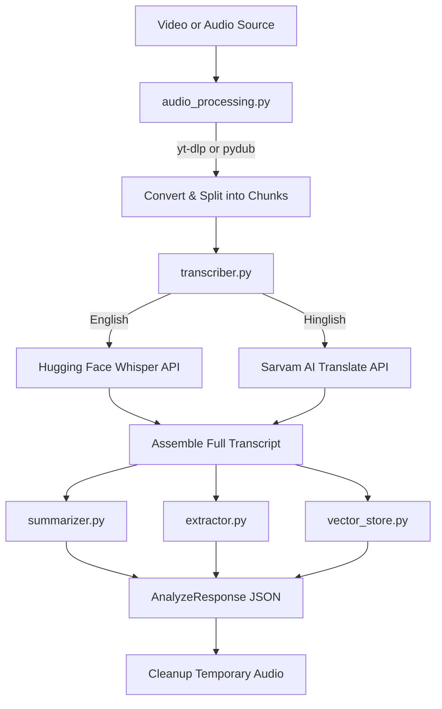
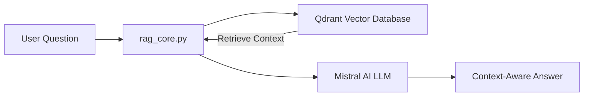
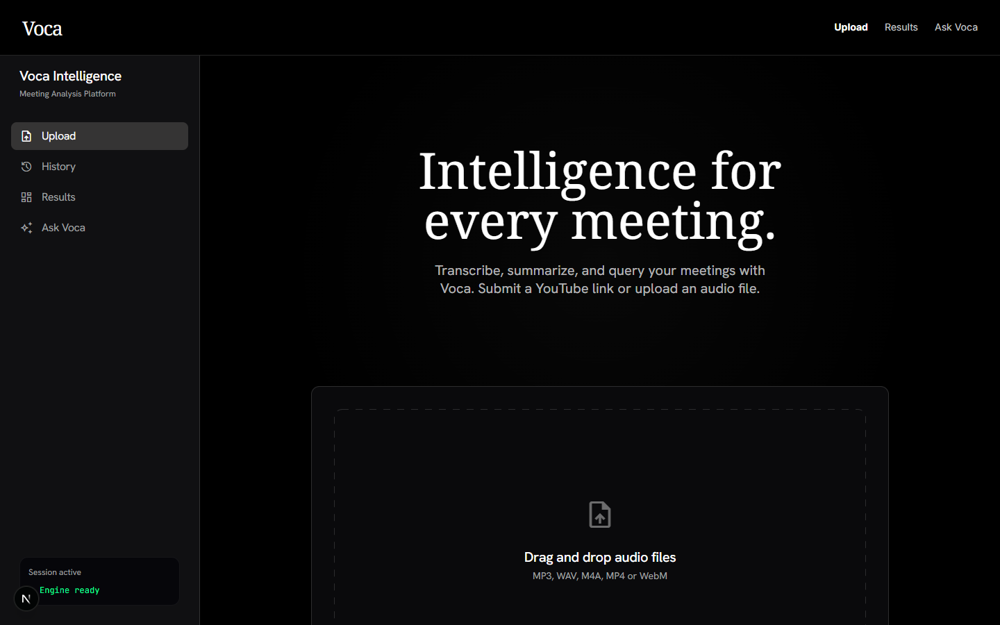
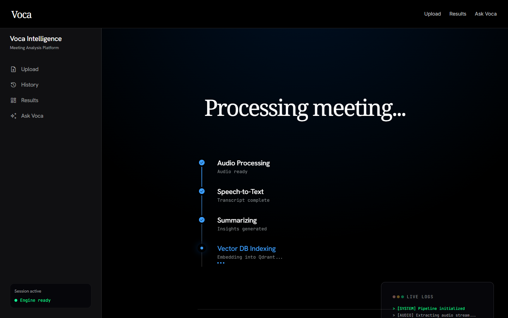
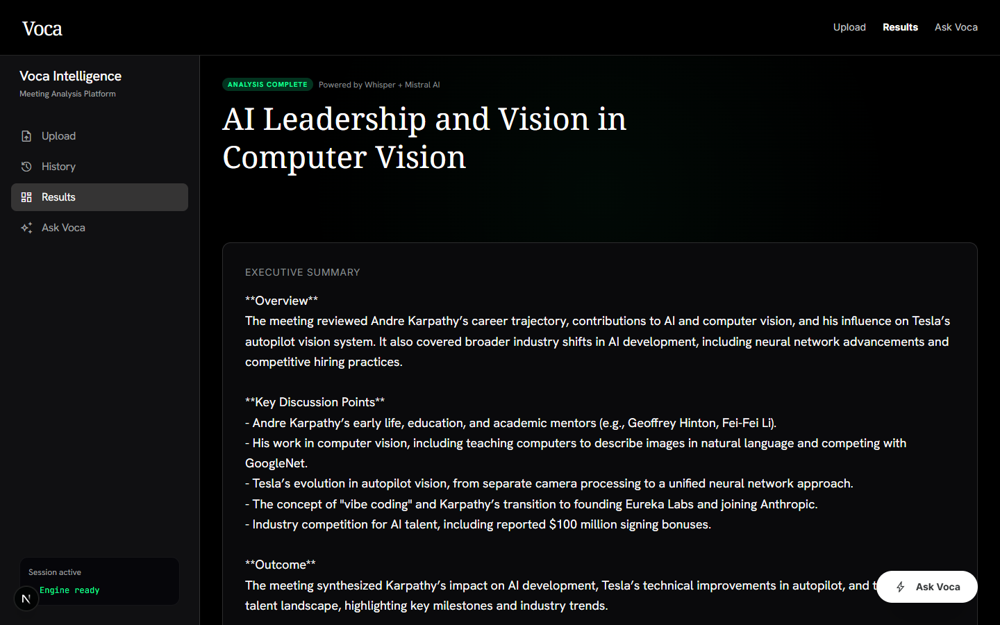
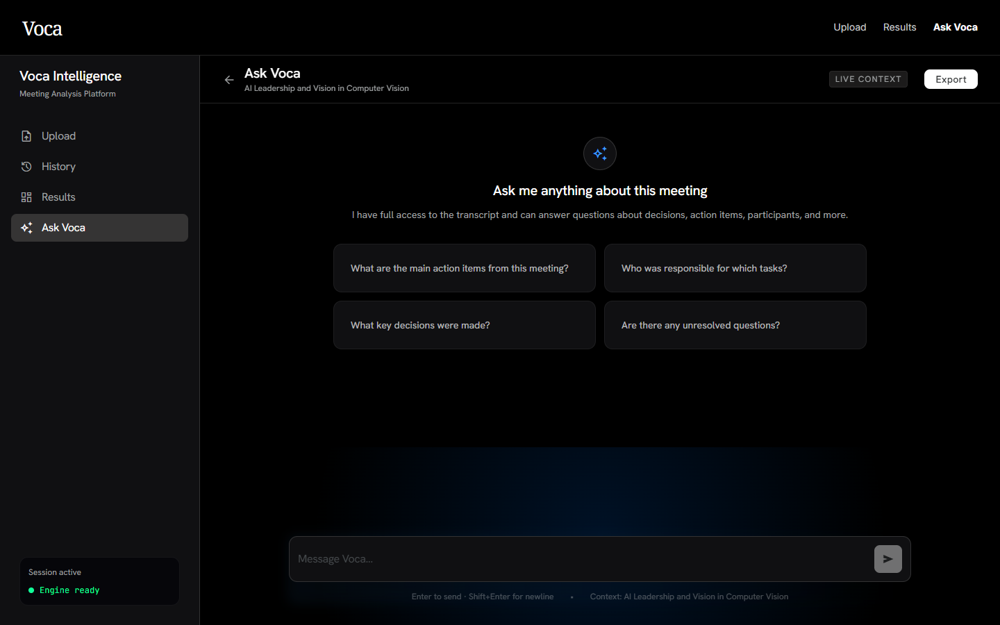
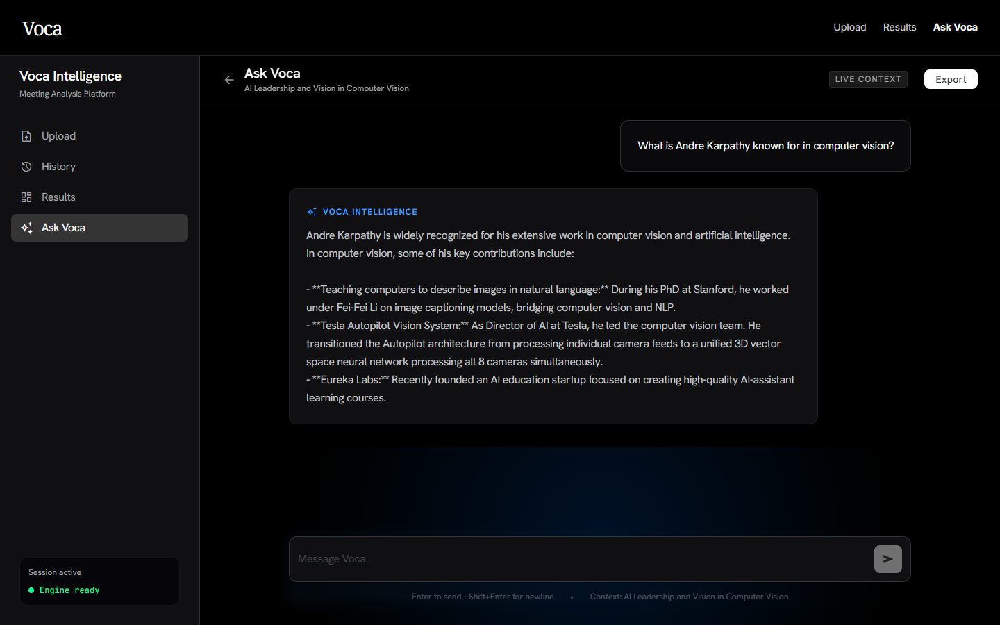
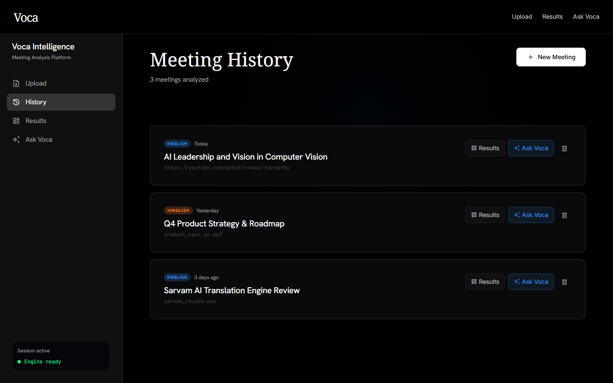

# Voca: AI-Powered Meeting Intelligence Platform

Voca (AI Video Helper) is a high-fidelity meeting intelligence platform that transforms video/audio files or YouTube links into a searchable, actionable knowledge base. It handles the complete pipeline: downloading audio, transcribing with language-specific routing (English & Hinglish), extracting executive summaries, and indexing transcripts into a vector database for natural language chat (RAG).

The user interface follows a premium, editorial design system inspired by Resend—featuring a pure black canvas, high-contrast typography, and low-opacity atmospheric glows.

---

## 🏗️ Architecture & Pipeline

### Visual Diagrams

| Workflow Diagram | Architecture & Pipeline |
| :---: | :---: |
|  |  |

#### Full Unified Architecture Map


### 1. End-to-End Pipeline (`POST /api/analyze` & `POST /api/analyze/stream`)



### 2. Retrieval-Augmented Generation (`POST /api/chat`)



---

## ✨ Features & New Additions

### 1. Stateful Pipeline Execution & SSE Streaming
* **SSE Stream (`/api/analyze/stream`)**: Real-time progress updates are sent to the client via Server-Sent Events (SSE) as each pipeline step finishes.
* **Pipeline Checkpoints (Fault Tolerance)**: After Step 1 (Transcription) and Step 2 (LLM Analysis), progress is saved in `meetings.json`. If a run fails due to network or API issues, the client can resume by submitting the same `meeting_id` to skip already completed steps.

### 2. Multi-Session Support & Meeting History
* **Distinct Qdrant Collections**: Instead of overwriting a single collection, each meeting gets a unique Qdrant collection name (`meeting_<uuid>`). Deleting a meeting also clears its vector collection.
* **Persistent History & Chat logs**: All completed analyses and corresponding RAG chat messages are stored in `meetings.json` inside the backend directory.

### 3. Modular Backend Routing
The backend API routing has been modularized under `apps/backend/api/`:
- `upload.py`: Handles raw audio/video uploads.
- `analyze.py`: Manages blocking and streaming analysis routes.
- `chat.py`: Directs context-aware RAG queries.
- `history.py`: Lists, details, and deletes historical sessions and conversations.

---

## 🛠️ Tech Stack

- **Monorepo Manager**: Turborepo & Bun
- **Frontend**: Next.js (TypeScript), Tailwind CSS
- **Backend**: Python 3.10+, FastAPI, LangChain
- **Vector Database**: Qdrant (supports both local disk-based DB and Qdrant Cloud)
- **AI Models**:
  - **Transcription**: Whisper (`openai/whisper-large-v3-turbo` via HF Inference) / Sarvam AI (Hinglish translation)
  - **Intelligence & LLM**: Mistral AI (`mistral-small-latest` via LangChain)
  - **Embeddings**: `all-MiniLM-L6-v2` via HuggingFace

---

## 📸 Application Screenshots

Here is a visual walkthrough of the Voca user interface, showcasing the premium, pitch-black editorial design system with high-contrast typography and subtle atmospheric glows:

### 1. Landing Page
*A clean, high-conversion entry point introducing Voca's capability to process video/audio files and YouTube links.*


### 2. Upload / Submission Form
*Simple drag-and-drop interface or YouTube URL submit form to kickstart meeting analysis.*


### 3. Real-Time Pipeline Progress (SSE Stream)
*Visual progress indicator showing real-time state changes and live console logs as Voca processes steps.*


### 4. Interactive Results Dashboard
*Beautiful, structured dashboard featuring an Executive Summary, checkable Action Items, key Decisions, and Open Questions.*


### 5. Chat Interface (Welcome State)
*A custom-built chatbot window with suggested prompts based on the analysis context.*


### 6. RAG-Enabled Active Chat
*Ask specific questions about the meeting transcript and receive context-aware, structured answers in real time.*


### 7. Historical Meeting Registry
*Browse all previously analyzed meetings, jump back to results or chat, and manage past sessions.*


---

## 🚀 Getting Started

### Prerequisites

Ensure you have the following installed:
- [Bun](https://bun.sh/) (for frontend and package management)
- Python 3.10+ (for backend)
- FFmpeg (automatically configured in Python virtualenv via `static-ffmpeg`)

### Backend Setup

1. Navigate to the backend directory:
   ```sh
   cd apps/backend
   ```
2. Create and activate a Python virtual environment:
   ```sh
   # On Windows (PowerShell)
   python -m venv .venv
   .venv/Scripts/activate

   # On macOS/Linux
   python -m venv .venv
   source .venv/bin/activate
   ```
3. Install dependencies:
   ```sh
   pip install -r requirements.txt
   ```
4. Create an `apps/backend/.env.local` file and add your keys (see **Environment Variables** below).

### Running the Project

From the **root** directory of the project, run all applications in development mode simultaneously:

```sh
bun dev
```
* **Frontend**: running on [http://localhost:3000](http://localhost:3000)
* **Backend**: running on [http://localhost:8000](http://localhost:8000)

---

## 🔑 Environment Variables

Create `apps/backend/.env.local` to override default settings:

| Variable | Required | Default / Recommendation | Description |
| :--- | :--- | :--- | :--- |
| `MISTRAL_API_KEY` | **Yes** | — | Mistral AI API key |
| `MISTRAL_MODEL` | No | `mistral-small-latest` | Mistral model used for summaries and extraction |
| `HF_TOKEN` | **Yes** | — | Hugging Face Access Token |
| `WHISPER_MODEL` | No | `openai/whisper-large-v3-turbo` | Hugging Face Whisper Model ID |
| `SARVAM_API_KEY` | No | — | Required only if processing **Hinglish** audio |
| `QDRANT_URL` | No | Local Disk-based DB | Qdrant Cloud URL (omit for local deployment) |
| `QDRANT_API_KEY` | No | — | Qdrant Cloud Key |

> [!IMPORTANT]
> **Hugging Face Token Permission Requirements:**
> If you are using a **Fine-grained access token** on Hugging Face, you **must** enable the **"Make calls to Inference Providers"** permission scope in your Hugging Face Token Settings. Otherwise, serverless API requests will return a `403 Forbidden` error.

---

## 📁 Repository Directory Structure

```
AI-Video-Helper/
├── apps/
│   ├── backend/
│   │   ├── api/                     # Modular API endpoints (upload, analyze, chat, history)
│   │   ├── core/                    # Core pipeline logic
│   │   │   ├── pipeline.py          # Orchestrates blocking/streaming analysis & checkpointing
│   │   │   ├── transcriber.py       # Whisper / Sarvam routing & chunk transcription
│   │   │   ├── summarizer.py        # MapReduce text summarization
│   │   │   ├── extractor.py         # Bulleted insights extractor factory
│   │   │   ├── vector_store.py      # Qdrant collection builder & retriever
│   │   │   └── rag_core.py          # LCEL RAG chain orchestration
│   │   ├── utils/
│   │   │   ├── audio_processing.py  # yt-dlp downloader & pydub wav converters
│   │   │   ├── hf_client.py         # HuggingFace client singleton
│   │   │   └── llm.py               # Mistral ChatMistralAI model singleton
│   │   ├── config.py                # Centralized environment configs
│   │   ├── storage.py               # JSON-based storage engine for history and checkpoints
│   │   ├── meetings.json            # Local storage database file
│   │   ├── main.py                  # FastAPI server entrypoint (CORS, Windows OS fixes)
│   │   └── requirements.txt         # Python dependencies
│   └── web/
│       ├── app/                     # Next.js app routes
│       │   ├── (app)/
│       │   │   ├── upload/          # URL submit & drag-and-drop file upload
│       │   │   ├── processing/      # Visual pipeline progress using SSE stream
│       │   │   ├── results/         # Multi-tab analysis dashboard
│       │   │   ├── chat/            # Meeting-specific RAG chatbot interface
│       │   │   └── history/         # Browse history & resume/load/delete sessions
│       ├── components/              # Sidebar & Navbar components
│       ├── lib/                     # API client & localStorage handlers
│       ├── design.md                # UI visual spec & tokens
│       └── tailwind.config.ts       # Tailwind theme integration
├── package.json                     # Monorepo dependencies & script definitions
└── turbo.json                       # Turborepo task pipeline configuration
```

---

## 🎨 Premium Editorial UI Design

Voca's UI is designed with an editorial aesthetic:
- **Luminance Contrast**: Pitch black background (`#000000`) with off-white text (`#fcfdff`) makes reading long transcripts comfortable.
- **Scarcity of Color**: Solid colors are rarely used. Instead, subtle, low-opacity **skyline atmospheric glows** (orange, blue, green, red, yellow) are anchored to headers of specific content sections.
- **Grid Elevation**: Shadows are replaced entirely by thin, translucent 1px white borders (`rgba(255,255,255,0.06)`).
- **Primary CTA**: The primary action button is a stark white pill container with black text, rendering it the brightest pixel on the screen and drawing focus immediately.

For details, refer to the full visual specifications in [apps/web/design.md](file:///d:/Projects/AI-Video-Helper/apps/web/design.md).
